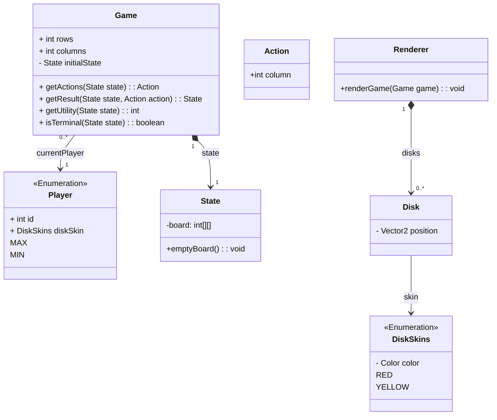

# MiniMaxConnect4

This is a simple implementation of the MiniMax algorithm for the game Connect 4.

## Class digrams

```mermaid
classDiagram

class Player{
    + int id
    + DiskSkins diskSkin
    <<Enumeration>>
    MAX
    MIN
}

class State{
    -board: int[][]
    +emptyBoard() : void

}

class Game{
    + int rows
    + int columns
    - State initialState
    + getActions(State state) : Action
    + getResult(State state, Action action) : State
    + getUtility(State state) : int
    + isTerminal(State state) : boolean
}

class Action{
    +int column
}

class Renderer{
    +renderGame(Game game) : void
}

Renderer "1" *--> "0..*" Disk : disks

class Disk{
    - Vector2 position
}

class DiskSkins{
    - Color color
    <<Enumeration>>
    RED
    YELLOW
}

Disk --> DiskSkins : skin

Game "1" *--> "1" State : state
Game "0..*" --> "1" Player : currentPlayer

```
